# Deploy a static website to S3

### S3 = Amazon "Simple Storage Service"

***
## Key Concepts

S3 is a storage solution, designed to make web-scale computing easier for developers.

Amazon S3 has a simple web services interface that you can use to store and retrieve any amount of data, at any time, from anywhere on the web. It gives any developer access to the same highly scalable, reliable, fast, inexpensive data storage infrastructure that Amazon uses to run its own global network of web sites.

Creating an S3 bucket is easy:
1. Create your account
2. Create a bucket
3. Add content to your bucket

https://docs.aws.amazon.com/s3/index.html

***
## 1. Create your bucket and set its permissions


### a. Access the S3 page
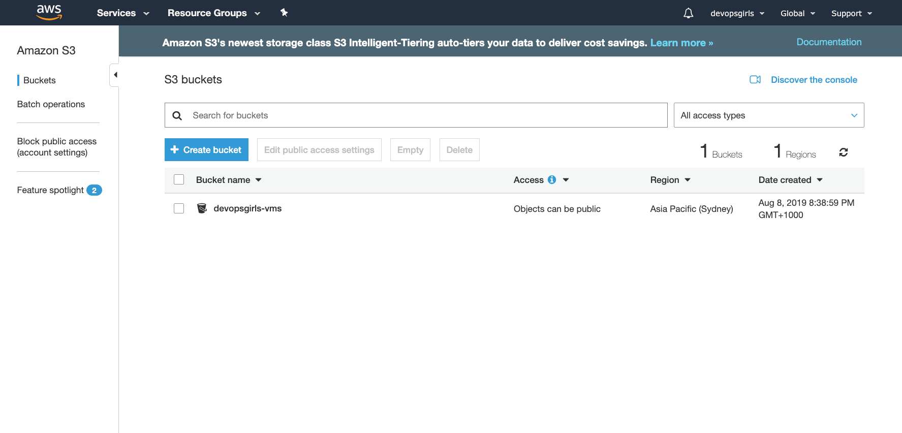


### b. Select "Create bucket"
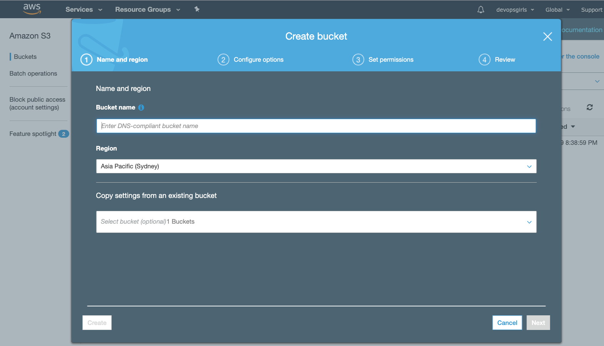


### c. Provide the bucket name continue

The bucket name needs to be unique, so consider a name like **yourname-devopsgirls**.

#### Click next until permissions

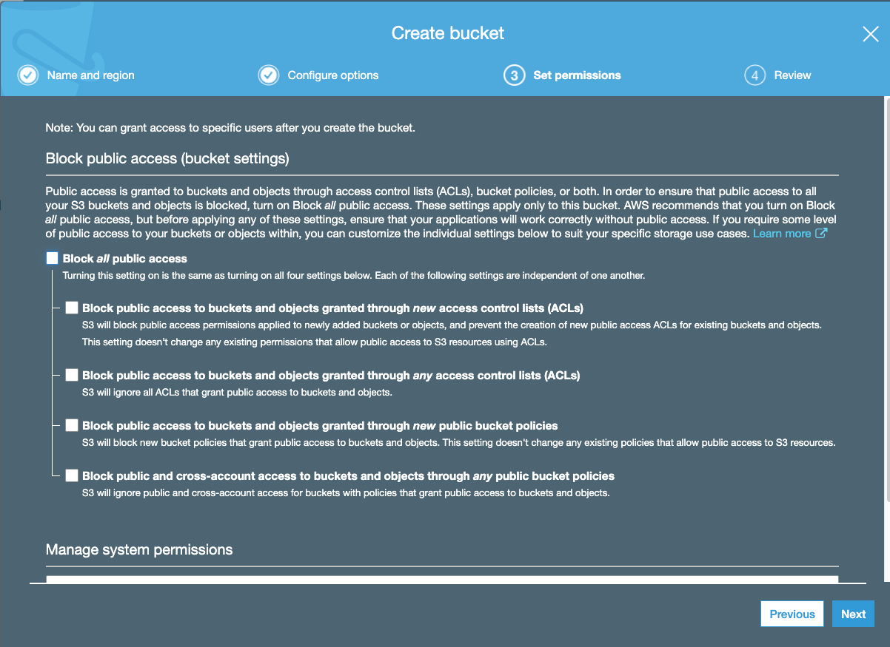

#### Confirm bucket creation

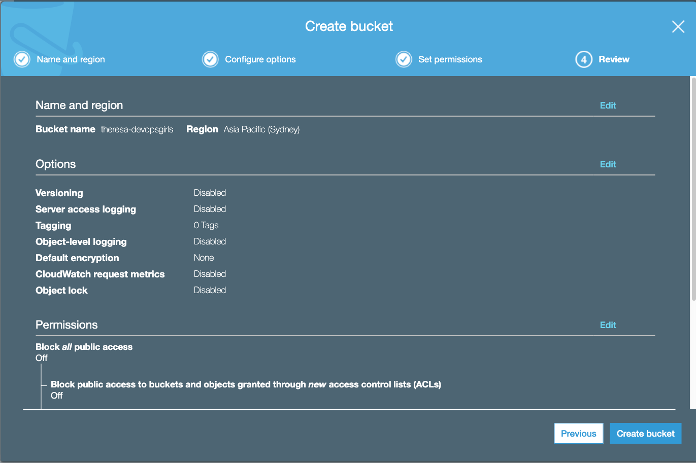

### d. Set up static website hosting settings
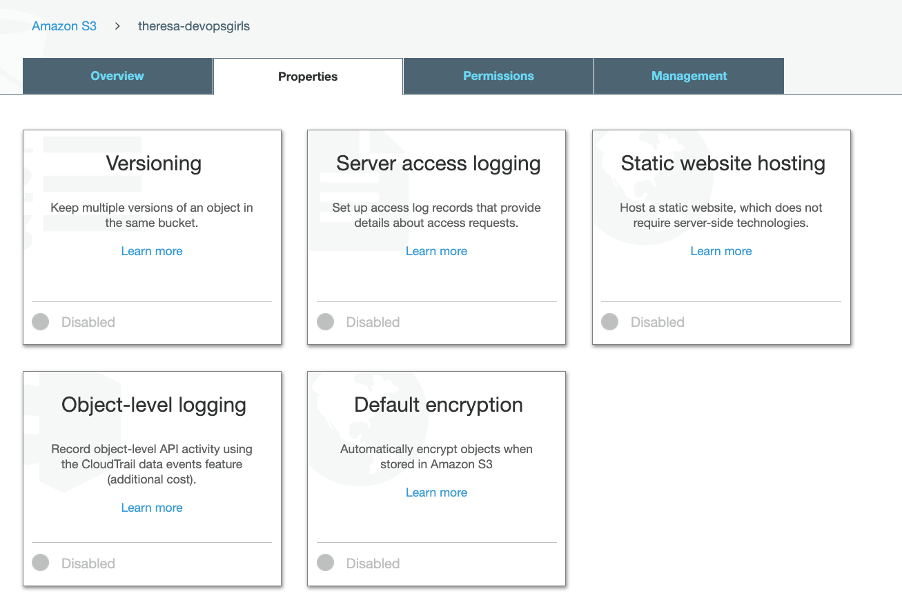

#### Type in the default index document (index.html)


### e. Set bucket policy
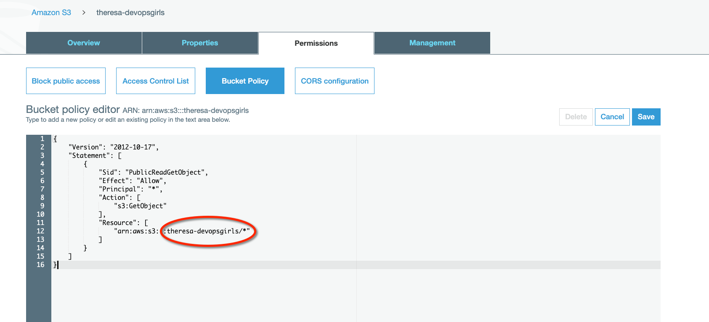

Copy the below code to your bucket policy, and then edit the code with own bucket name in the 'example-bucket' text:

```
{
  "Version":"2012-10-17",
  "Statement":[{
	"Sid":"PublicReadGetObject",
        "Effect":"Allow",
	  "Principal": "*",
      "Action":["s3:GetObject"],
      "Resource":["arn:aws:s3:::example-bucket/*"
      ]
    }
  ]
}
```

## 2. Select and download a website template

### a. Select a website template you'd like to download

Go to this page for ready to go website templates: https://html5up.net/

(credit to the fantastic [AJ](https://twitter.com/ajlkn) for these templates)

### b. Download and unzip the website


## 3. Upload your website to your bucket

### a. Open the folder where your downloaded files are


### b. Upload the files

#### Select all
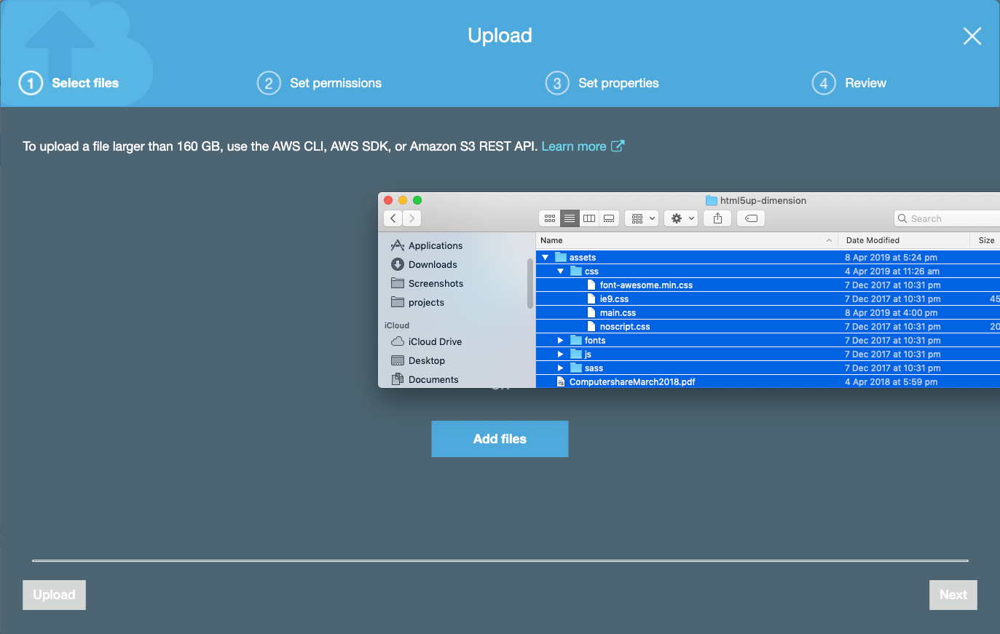


#### Drag these selected files and drop into S3

Ensure you include all the files, including the license and readme

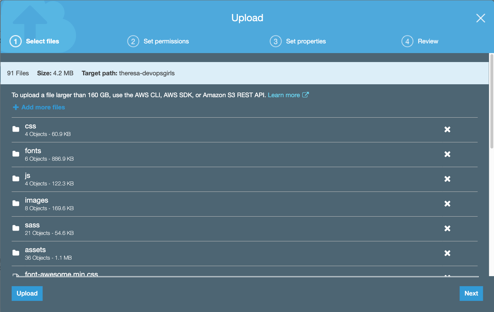

#### Click Upload

The successfully uploaded files will be listed in the S3 bucket:
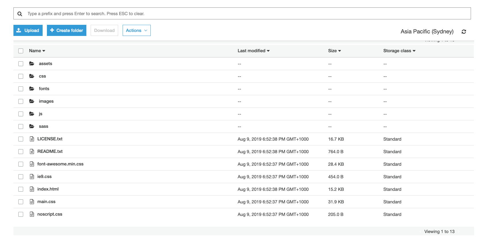

#### Just check that the index.html is visible in the bucket 'root' directory (not embedded in another folder)


## 3. Success! View your website
### Open the static website page setting again and select bucket/website endpoint
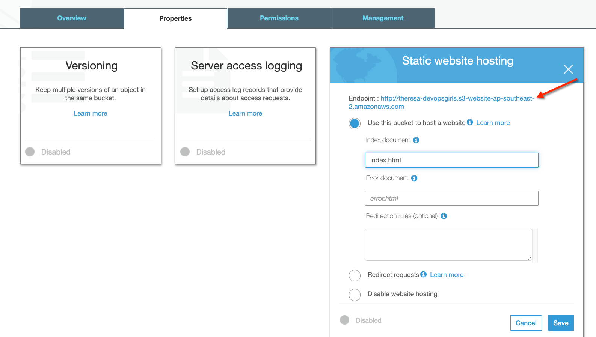

### Paste that into a browser and press Enter
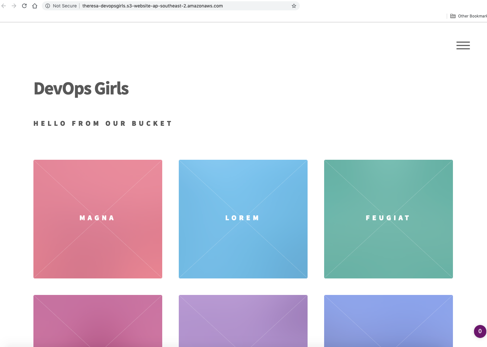

***

## Next steps - edit your website, or continue on with the agenda

### 1. Edit your website

#### Begin with the index.html file
1. Edit the file on your local machine using a text editor
2. Preview the changes in your browser
3. When you are happy with its look, upload the file again to S3

##### HTML tutorial:
https://www.w3schools.com/html/

### 2. Continue on with the agenda
https://github.com/DevOps-Girls/DevOpsTesting101/blob/master/1-0-Agenda.md
