# Deploy Wordpress to EC2 from a Template

### EC2 = "Elastic Compute Cloud"

## Key Concepts

Before we get started, let's go over some basic concepts first:

 - *An EC2 Instance is a server in the cloud*. Think of it as a computer - your laptop, for example - that's installed somewhere else, and is available for you to access and manage. You can install and do whatever you want to that server.

 - *SSH is a way to remotely access that server*. You can either use a password or a key pair to access that server. Think of a key pair as a file that functions as a set of keys; you can duplicate, or transfer it to another computer, but you'll need that key to access your server.

 - *Security groups are like your firewall*. It's essentially a list of what kind of traffic you're allowing to your instance. This is important: you want remote *management* access to be narrowed down as much as possible.

Now that that's out of the way, let's get started!

## What we're going to do

In this practical exercise, we will do the following:

 - Create an SSH keypair
 - Create an EC2 instance from a template
 - Put a simple Wordpress blog on it

## Creating your instance

For this exercise, you will be accepting the defaults as presented.

### 1.A) Pre-requisite: you are already logged into your AWS account

See [0-1 Setup](0-1-Setup.md).

This will take you to the AWS Console.

### 1.B) Make sure you're in the right region

Then, we'll need to make sure we're working somewhere close. On the top-right side, make sure you select *Sydney*.

![Region][1-1-0-region]

### 2.) Go into the EC2 section

If you click on **Services**, you should see something similar to below. Because Amazon has a lot of services, you might want to type out *EC2* on the search box. Click on the link afterwards.

![DevOpsGirls-1-1-2][1-1-2-gotoec2]

### 3.) Create your key pair

The first thing we'll need to do is to create a key pair. This will be the key file that you will use to login to your instance. On the left-hand section, go to **Key Pair**, then click on **Create Key Pair**.

![Create key pair][1-1-3-keypair]

Make sure you name this key pair accordingly (how about **_yourname_-devopsgirls**) and notice where it's downloaded to. This will typically be your default Downloads folder.

You're going to need to remember its name and location for later.

### 4.) Create your EC2 Instance

The next thing we'll need to do is create your *EC2 Instance*. To do so, we'll need to go to the left-hand side of the panel, and choose "Instances". Click on *"Launch Instance"*.

![Launch instance][1-1-4-launchinstance]

### 5.) Select the Wordpress template

An AMI (Amazon Machine Image) is essentially the *operating system* or *template* that you'll have on your instance. Have a look around - there's a ton of pre-baked AMIs that you can use, which range from Windows, to Linux, to more specialised systems.

For this lesson, we are choosing a template provided on the AWS marketplace, called "WordPress Certified by Bitnami and Automattic":

1. Click on AWS Marketplace
2. Search for "WordPress"
3. Select the "WordPress Certified by Bitnami and Automattic" image

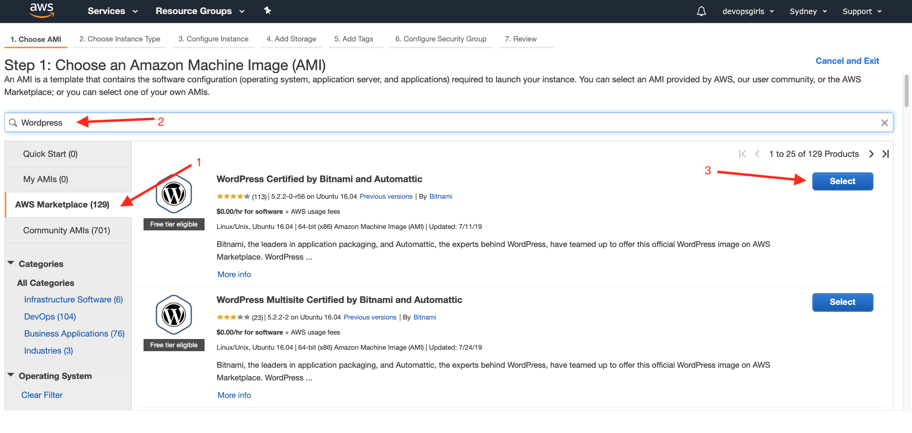

### 6.) Choose your instance type

When you think of instance types, think of it as asking the question: *"How big do I want my servers to be?"*

![instancetype][1-1-5-instancetype]

Note that the per-hour pricing varies with each instance type, and that some of them are suited for very specific tasks. For this example, we're going to choose a small size: a *t2.micro*.

The below is displayed as info:

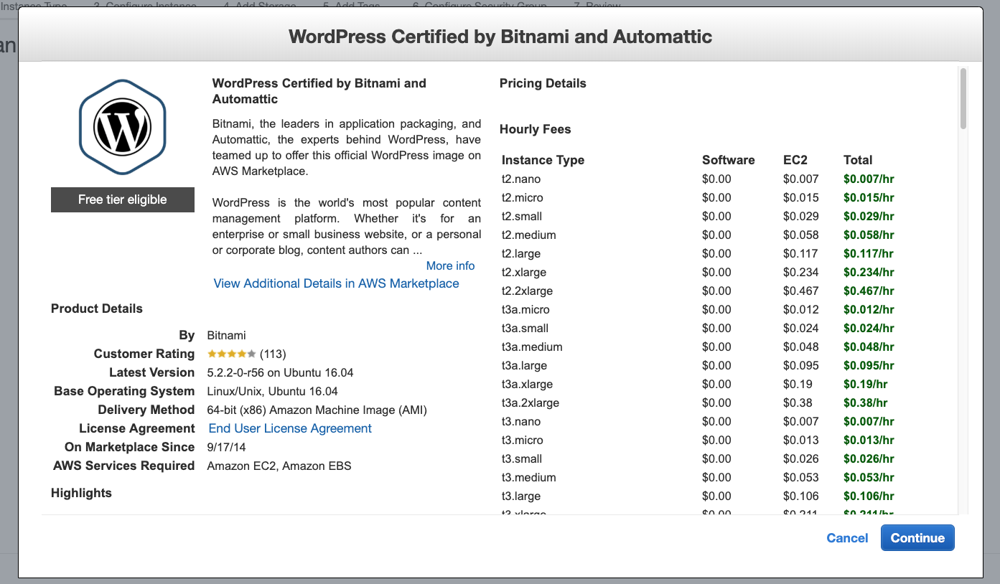

### 7.) Take a look at instance details

We're not going to change anything in this section - but these are additional networking and authorisation details that you can specify when creating an instance. Where are you going to install it? Will it be private, or public? How does it handle being shut down?

![Instance details][1-1-6-instancedeets]

For the moment, we're going to be picking the defaults. Click on **"Add Storage"** afterwards.

### 8.) Specify your disks/storage

In the same way that any computer has disks to store the data in, you'll also need ones for your AWS instance. We can change the size, the type, and how fast it will be.

![Disks][1-1-7-instancestor]

Again, we're sticking with the defaults, so click on "**Next: Add Tags**".

### 9.) Tagging your instance

Tagging your instance is important - think of it as a way to identify your instance. Different companies tag their instances differently - and you can have up to 10 tags per instance!

![Instancetags][1-1-8-instancetags]

For this example, we're going to tag your instance with a *Name*. Put *Name* in the box below *Key*; put any name you want on the *Value*, like **DevOpsGirls Wordpress**. This will be the name of your instance when you see it on a list later.

### 10.) Checking security groups

Because this is a template, the security groups have already been set for you.

They are:
* SSH - for remote secure shell access
* HTTP - for website HTML transfer
* HTTPS - for secure website HTML transfer

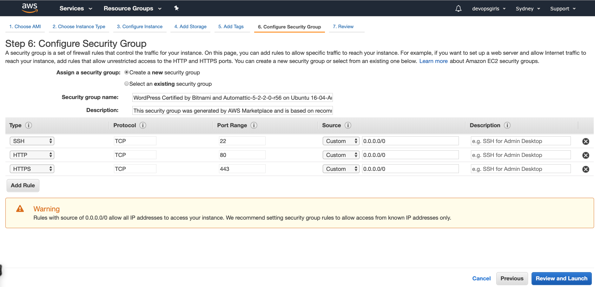

You also have the option to specify **My IP** in the SSH section, so that only you can access the management traffic for your instance.

### 11.) Using the keypair you made previously

The summary page shows you:

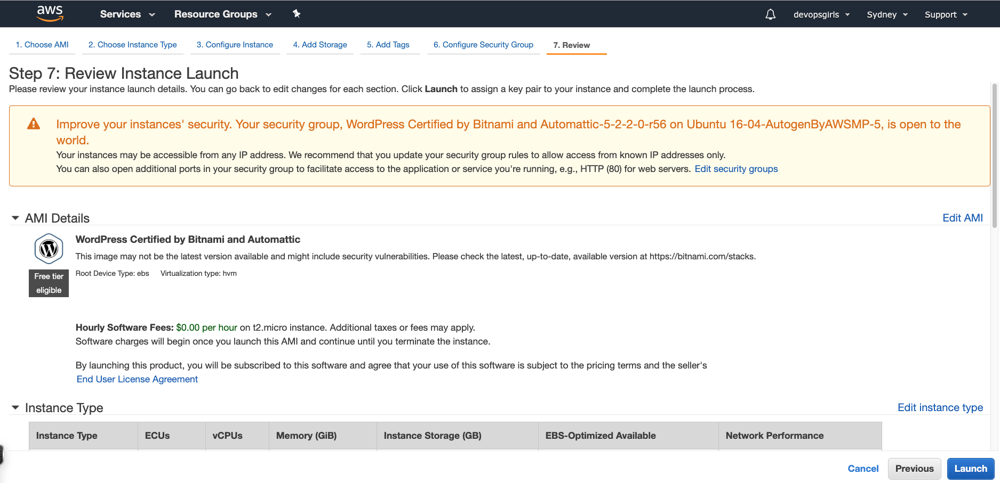

Accept the defaults and press **Launch**.

Finally, we get to the part where you have to choose the key file that you want to access your instance with. Remember the key pair you made earlier? Select **Choose an existing keypair** and select the name of the keypair you made previously. Now, click on **Launch Instance**.

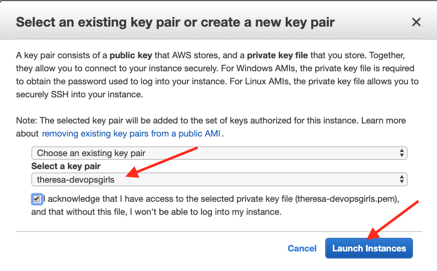

### 12.) Launching your instance

Once your instance launches, you'll see a window that shows your instance IDs There will also be details below of how you should connect to your instance. You can follow these, or you can click on the next few links.

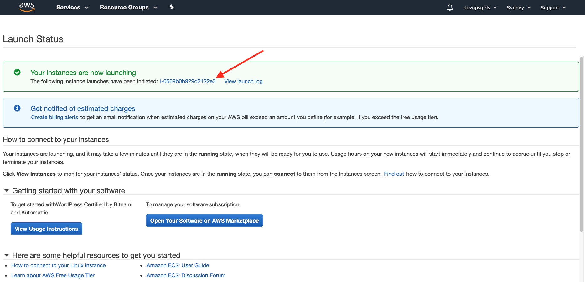

You can click on the instance ID, to take you to its properties.

### 13.) Name your instance

For better recognition, name your instance.

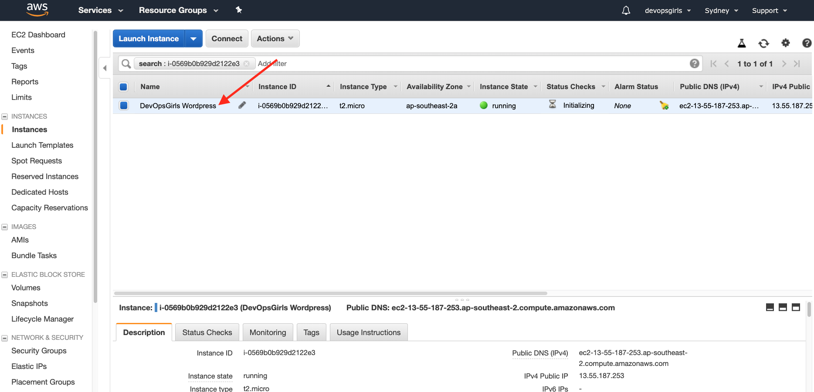

### 14.) Seeing your instance properties

In the section below the instance name, you're going to see a list if your instance properties - what it's called, what the IP addresses are, and where it lives. You're going to want to look for the section that says **Public IP**.

![Properties][1-1-12-properties]

### 15.) Checking your Wordpress page

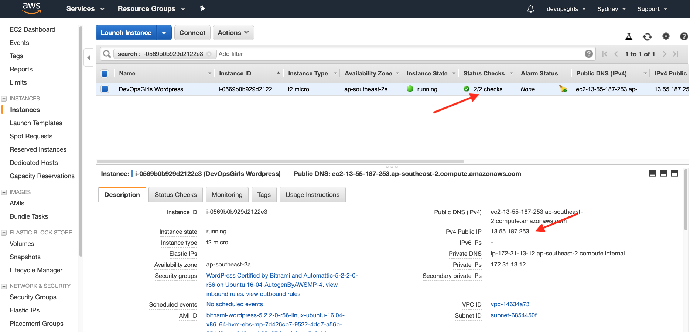

Once your instance has finished loading, use the **Public IP** from above, copy that and paste it into a browser page.  

You should see this landing page:

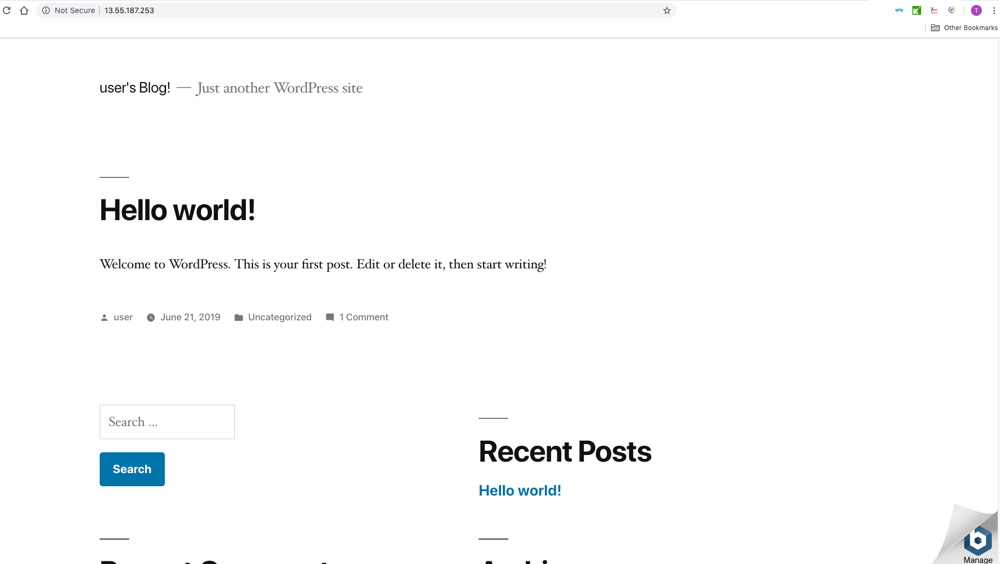

## 16.) Logging in

### Log into WordPress

On the WordPress home page, select "Log In".

Your username will be **user**.

#### Finding your WordPress password:

https://docs.bitnami.com/aws/faq/get-started/find-credentials/

**Note:** This log file reading can be a bit tricky and the log file contents are not always displayed at first. The trick is to keep trying, and we have found eventually the log file does display the content.

Once you find your password in the log file, we discovered you *have* to right-click and Copy this password. Pressing Ctrl-C or Cmd-C, somehow doesn't work.

#### Once you have found your credentials, try logging in:

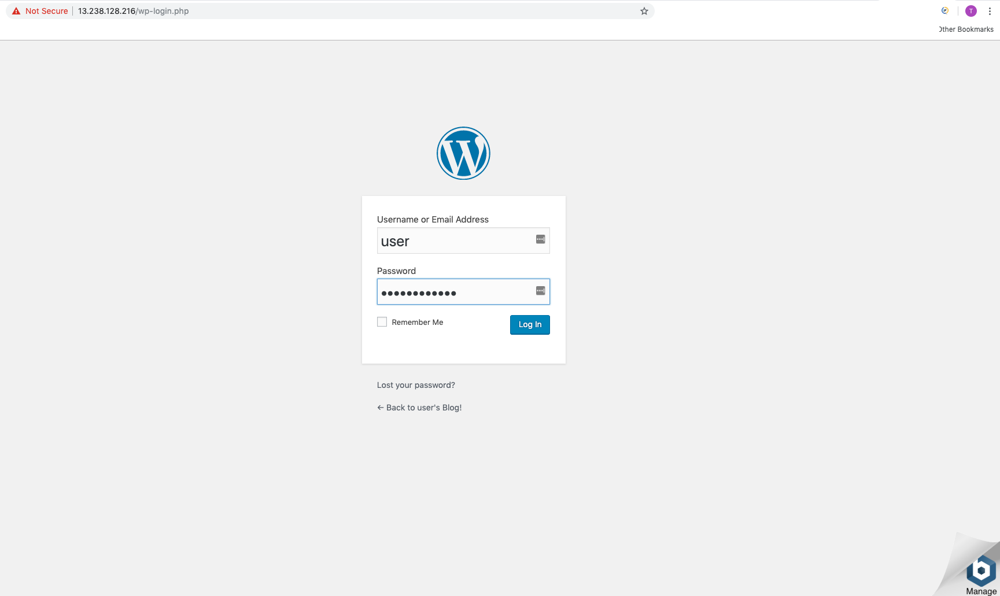

#### This should work and you will see this page:

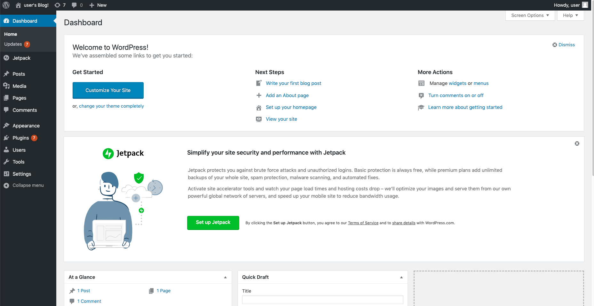

### Login to your instance

Make note of the IP address you saw in your instance properties. Use the following guides depending on what operating system you have:

 - [If you are using a Mac](https://github.com/DevOps-Girls/DevOpsTesting101/blob/master/8-1-SSH-from-Mac.md)
 - [If you are using Windows](https://github.com/DevOps-Girls/DevOpsTesting101/blob/master/8-2-SSH-from-Windows.md)

## 17.) Congratulations!

If you made it this far, congratulations. You have a choice now, to play with your Linux shell, or to add monitoring.

For the Linux shell: https://github.com/DevOps-Girls/DevOpsTesting101/blob/master/4-1-Adventure.md#a-linux-command-line-cli-101

For monitoring: https://github.com/DevOps-Girls/DevOpsTesting101/blob/master/3-1-Monitoring.md

[1-1-0-region]: https://raw.githubusercontent.com/DevOpsGirls/devopsgirls-bootcamp/master/images/1-1-EC2/1-1-0-region.png
[1-1-1-awslogin]: https://raw.githubusercontent.com/DevOpsGirls/devopsgirls-bootcamp/master/images/1-1-EC2/1-1-1-awslogin.png
[1-1-2-gotoec2]: https://raw.githubusercontent.com/DevOpsGirls/devopsgirls-bootcamp/master/images/1-1-EC2/1-1-2-gotoec2.png
[1-1-3-keypair]: https://raw.githubusercontent.com/DevOpsGirls/devopsgirls-bootcamp/master/images/1-1-EC2/1-1-3-keypair.png
[1-1-4-launchinstance]: https://raw.githubusercontent.com/DevOpsGirls/devopsgirls-bootcamp/master/images/1-1-EC2/1-1-4-launchinstance.png
[1-1-4-ami]: https://raw.githubusercontent.com/DevOpsGirls/devopsgirls-bootcamp/master/images/1-1-EC2/1-1-4-ami.png
[1-1-5-instancetype]: https://raw.githubusercontent.com/DevOpsGirls/devopsgirls-bootcamp/master/images/1-1-EC2/1-1-5-instancetype.png
[1-1-6-instancedeets]: https://raw.githubusercontent.com/DevOpsGirls/devopsgirls-bootcamp/master/images/1-1-EC2/1-1-6-instancedeets.png
[1-1-7-instancestor]: https://raw.githubusercontent.com/DevOpsGirls/devopsgirls-bootcamp/master/images/1-1-EC2/1-1-7-instancestor.png
[1-1-8-instancetags]: https://raw.githubusercontent.com/DevOpsGirls/devopsgirls-bootcamp/master/images/1-1-EC2/1-1-8-instancetags.png
[1-1-9-secgroups]: https://raw.githubusercontent.com/DevOpsGirls/devopsgirls-bootcamp/master/images/1-1-EC2/1-1-9-secgroups.png
[1-1-10-keypair]: https://raw.githubusercontent.com/DevOpsGirls/devopsgirls-bootcamp/master/images/1-1-EC2/1-1-10-keypair.png
[1-1-11-launch]: https://raw.githubusercontent.com/DevOpsGirls/devopsgirls-bootcamp/master/images/1-1-EC2/1-1-11-launch.png
[1-1-12-properties]: https://raw.githubusercontent.com/DevOpsGirls/devopsgirls-bootcamp/master/images/1-1-EC2/1-1-12-properties.png
[1-1-13-blankbrowser]: https://raw.githubusercontent.com/DevOpsGirls/devopsgirls-bootcamp/master/images/1-1-EC2/1-1-13-blankbrowser.png
[1-1-15-wordpresssetup]: https://raw.githubusercontent.com/DevOpsGirls/devopsgirls-bootcamp/master/images/1-1-EC2/1-1-15-wordpresssetup.png
[1-1-16-wpsqlsetup]: https://raw.githubusercontent.com/DevOpsGirls/devopsgirls-bootcamp/master/images/1-1-EC2/1-1-16-wpsqlsetup.png
[1-1-17-wpfinished]: https://raw.githubusercontent.com/DevOpsGirls/devopsgirls-bootcamp/master/images/1-1-EC2/1-1-17-wpfinished.png
